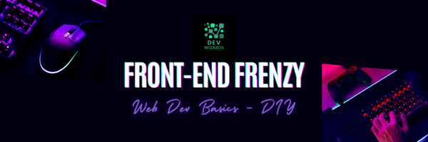

<section style="text-align:center" align="center">

</section>

---

# 📘 Front-End Frenzy: Web Dev Basics - DIY

- [Project Gallery](PROJECTS.md)
- [Event Images](EVENT_IMAGES.md)

## 1. Introduction

### Overview of the Event

Welcome to **Front-End Frenzy: Web Dev Basics - DIY**! This event is designed to kickstart your journey into web development. Over the next 30 days, you'll learn HTML, CSS, and JavaScript through daily challenges, building projects that you can showcase in your portfolio.

### What You'll Achieve

By the end of this event, you’ll have:

- A solid understanding of HTML, CSS, and JavaScript fundamentals.
- Improved problem-solving and coding skills.
- A community of like-minded developers to continue your learning journey.

#### Rewards

- All participants will earn stickers, and the top performer will receive a GitHub T-shirt!

- We also have something special planned for sticker distribution day—stay tuned!

---

## 2. Getting Started

### Prerequisites

- Basic knowledge of using a computer and the internet.
- Basic knowledge of GitHub.
- Willingness to learn and experiment.

### Account Setup

Before you begin, please set up the following accounts:

1. **GitHub**: [Sign up here](https://github.com/) and join the [Dev Wizards](https://github.com/Dev-Wizards) organization.
2. **Discord**: [Join our community](https://discord.gg/mP8WuPVR2N) where you can ask questions, share your progress, and interact with other participants.

### Joining the Community

After creating your accounts, make sure to:

- Introduce yourself in the Discord community.
- Set up your GitHub profile with a short bio and profile picture.
- Follow the [Dev Wizards GitHub organization](#) to stay updated with the latest resources and challenges.

### Registration

Fill out the registration form [here](https://forms.gle/RXVvps74qXbSY5bB9).

> _Note: You must provide accurate information so that we can identify you for reward distribution._

---

## 3. Daily Challenges

### How to Access Daily Files

Each day, a new challenge file will be available in the event’s repository on GitHub. Navigate to the [Daily Challenges](/Daily%20Challenges) folder to find the Markdown file for the current day.

### Structure of Each Day’s Challenge

Every day’s challenge will include:

- **Welcome Message**: A motivational note to kickstart your day.
- **Topic Overview**: What you’ll learn today.
- **Resources**: Links to tutorials, videos, and articles.
- **Mini Project**: A small coding task to apply what you've learned.

### Suggested Learning Resources

Feel free to use:

- YouTube tutorials.
- FreeCodeCamp and W3Schools.
- AI tools like ChatGPT for quick help.
- Documentation and online forums.

### Mini Projects and Practical Applications

Each challenge includes a mini project. Completing these projects will help solidify your understanding and give you practical experience. By the end of the event, you'll have a portfolio of small web projects.

---

## 4. Weekly Milestones

### Explanation of Milestones

At the end of each week, you'll face a milestone challenge that brings together everything you’ve learned. These challenges are larger projects that may require extra time and effort.

### How to Submit Your Work

Submit your completed milestone projects via GitHub by pushing your code to your repository. Share your project link in the designated Discord channel.

For detailed instructions, take a look at the [HowToSubmit](/HowToSubmit.md) file.

For final project submission guidelines, refer to the [PROJECT_SUBMISSION.md](./PROJECT_SUBMISSION.md) file.
### Evaluation Criteria

Milestone projects will be evaluated based on:

- Code quality.
- Creativity and design.
- Functionality and completeness.

---

## 5. Final Challenge

### Details of the Final Challenge

On the 30th day, you’ll be given a comprehensive challenge that will test all the skills you've learned. This final project will weigh heavily in determining the top performer.

### How It Contributes to Rewards

The final challenge is crucial for winning the GitHub T-shirt and other top prizes. Make sure to give it your best effort!

### Submission Guidelines

Submit your final project by pushing it to your GitHub repository and sharing the link in the final challenge submission thread on Discord.

---

## 6. Earning Rewards

### Stickers and T-Shirts

- **Stickers**: All participants who complete the daily challenges will receive event stickers.
- **GitHub T-Shirt**: The top performer, as determined by the quality of the final project, will win a GitHub T-shirt.

### Criteria for Top Performer

The top performer will be selected based on:

- Consistent participation.
- Quality and creativity of projects.
- Engagement and support within the community.

### Surprise Rewards

On sticker distribution day, we’ll reveal a special surprise for all active participants! Stay tuned for more details.

---

## 7. Rules and Guidelines

### Participation Etiquette

- Be respectful and supportive in all interactions.
- Help others by sharing your knowledge.
- Stay active and engaged in the community.

### Submission Deadlines

- All daily challenges and the milestone should be submitted by the end of each week.
- The final challenge must be submitted by one week after the event's last day.

### Academic Integrity

- Do not plagiarize or copy others' work. Originality is key.
- Feel free to seek help, but make sure you understand the solutions you implement.

---

## 8. FAQ

### Common Questions and Answers

**Q: When is the event scheduled to start?**

A: The event dates will be announced via email and Discord.

**Q: What are the requirements for participation?**

A: Only the students from **SHMM GDC Anantnag**, **GCET Ganderbal**, **GDC Baramullah**, **GDC Kulgham**, and **GDC Bandipora** can register for the event.

**Q: What if I miss a day?**

A: Don’t worry! You can catch up on missed challenges, but try to stay on track to get the most out of the event.

**Q: Do I need to be online at specific times?**

A: No, the challenges are self-paced, so you can complete them at your convenience each day.

**Q: Can I use external resources?**

A: Absolutely! Use any resources you find helpful, but ensure you understand the concepts being taught.

---

## 9. Support

### How to Get Help

If you encounter any issues or have questions:

- Ask in the Discord support channel.
- Reach out to mentors or event organizers.

---

## 10. Ending Notes

We’re excited to see what you build over the next 30 days! Good luck, and have fun coding! 🚀

It's okay if you only know a bit of HTML and CSS right now—this is the perfect opportunity to get started. If you're a beginner, you'll learn essential terminology and concepts, even if you use AI tools to help you along the way. If you're experienced, you'll get the chance to help others, earn stickers, and maybe even win a t-shirt.

Get ready to elevate your web skills!
